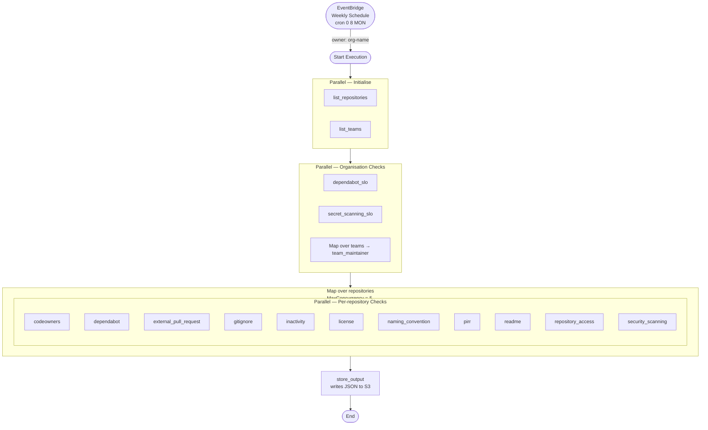

# Step Function Flow — GitHub Policy Audit

## Overview

The Step Function is triggered weekly by an EventBridge schedule and orchestrates all Lambda functions to audit GitHub organisation policy compliance, then store the results to S3.

**Trigger:** `cron(0 8 ? * MON *)` — every Monday at 08:00 UTC  
**Input:** `{"owner": "<org-name>"}`

## Flow

## Stage Summary

| Stage | State Type | Lambdas |
| --- | --- | --- |
| Initialise | `Parallel` | `list_repositories`, `list_teams` |
| Organisation checks | `Parallel` + inner `Map` for teams | `dependabot_slo`, `secret_scanning_slo`, `team_maintainer` |
| Repository checks | `Map` (MaxConcurrency=5) → inner `Parallel` | `codeowners`, `dependabot`, `external_pull_request`, `gitignore`, `inactivity`, `license`, `naming_convention`, `pirr`, `readme`, `repository_access`, `security_scanning` |
| Store output | `Task` | `store_output` |

## Rate Limit Considerations

The repository checks `Map` state uses `MaxConcurrency = 5` (configurable) to limit simultaneous GitHub API calls and stay within rate limits. The 11 per-repository checks run in parallel **within** each Map iteration, but since they target different API endpoints this is low risk.
