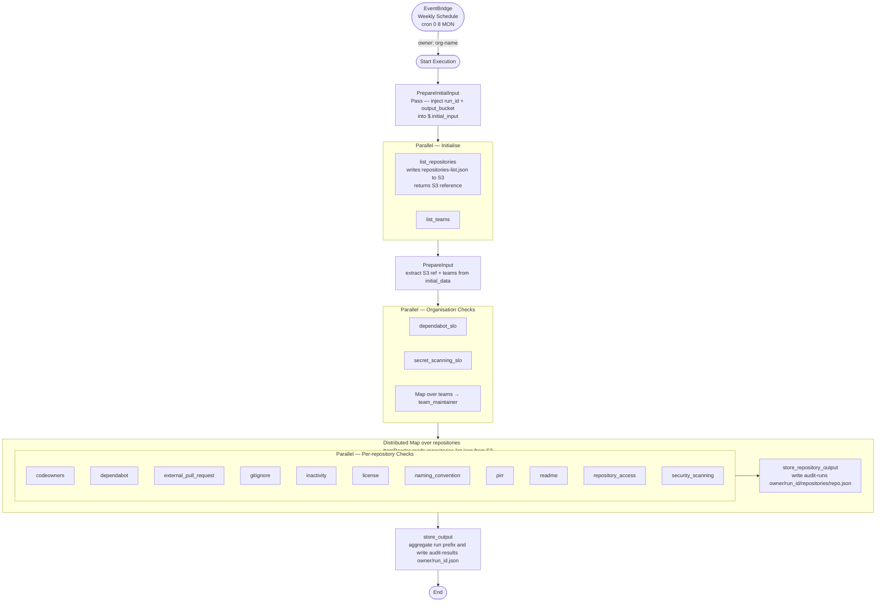

# Step Function Flow — GitHub Policy Audit

## Overview

The Step Function is triggered weekly by an EventBridge schedule and orchestrates all Lambda functions to audit GitHub organisation policy compliance, then store results in S3 using run-scoped prefixes.

**Trigger:** `cron(0 8 ? * MON *)` — every Monday at 08:00 UTC  
**Input:** `{"owner": "<org-name>", "levels": ["critical", "high", "medium", "low"]}`

## Rate Limit Notes

Due to the size of some GitHub Organisations, the step function may only be able to run once per hour. The `MaxConcurrency` of the repository checks map is configurable to limit simultaneous GitHub API calls and stay within rate limits.

The function has been tested against 2 organisations of various sizes:

- Organisation A:
  - ~1,400 repositories
  - ~350 teams
  - ~17 minutes execution time (with `MaxConcurrency = 5`)
- Organisation B:
  - ~100 repositories
  - ~20 teams
  - ~1.5 minutes execution time (with `MaxConcurrency = 5`)

Scaling beyond 1,500 repositories may require further tuning of `MaxConcurrency` and/or splitting the organisation into multiple runs.
For our current use case at ONS, the current configuration is sufficient to run weekly audits of all repositories and teams in a single execution.

## Flow



## Stage Summary

| Stage                  | State Type                                                | Lambdas                                                                                                                                                                    |
| ---------------------- | --------------------------------------------------------- | -------------------------------------------------------------------------------------------------------------------------------------------------------------------------- |
| Prepare initial input  | `Pass`                                                    | None (injects `run_id` and `output_bucket` into `$.initial_input`)                                                                                                         |
| Initialise             | `Parallel`                                                | `list_repositories` (writes to S3, returns reference), `list_teams`                                                                                                        |
| Prepare input          | `Pass`                                                    | None (reshapes state; promotes S3 ref and teams)                                                                                                                           |
| Organisation checks    | `Parallel` + inner `Map` for teams                        | `dependabot_slo`, `secret_scanning_slo`, `team_maintainer`                                                                                                                 |
| Repository checks      | `Map` (Mode=`DISTRIBUTED`, MaxConcurrency=5) + `Parallel` | `codeowners`, `dependabot`, `external_pull_request`, `gitignore`, `inactivity`, `license`, `naming_convention`, `pirr`, `readme`, `repository_access`, `security_scanning` |
| Repo output write      | `Task`                                                    | `store_repository_output`                                                                                                                                                  |
| Final aggregation      | `Task`                                                    | `store_output`                                                                                                                                                             |

## Storage and Lifecycle

Repository-level artifacts are written to:

- `audit-runs/<owner>/<run_id>/repositories/<repository>.json`

Final run summary is written to:

- `audit-results/<owner>/<run_id>.json`

S3 lifecycle rules manage growth:

- `audit-runs/` uses short retention (`audit_run_retention_days`, default 30).
- `audit-results/` uses longer retention (`audit_summary_retention_days`, default 365).

## Rate Limit and State Size Considerations

The repository checks map uses `Mode = DISTRIBUTED` and `MaxConcurrency = 5` (configurable) to limit simultaneous GitHub API calls and stay within rate limits.

The 11 per-repository checks run in parallel within each repository item, but Step Functions state remains small because repository check outputs are persisted to S3 and discarded from parent execution state after each item.

## Data Flow

### 1. EventBridge → PrepareInitialInput

EventBridge injects the initial execution input:

```json
{
    "owner": "ONS-Innovation",
    "levels": ["critical", "high", "medium", "low"]
}
```

`PrepareInitialInput` is a Pass state that injects the execution name as `run_id` and the audit S3 bucket as `output_bucket`. It writes these into `$.initial_input` using `ResultPath`, preserving the original top-level keys:

```json
{
    "owner": "ONS-Innovation",
    "levels": ["critical", "high", "medium", "low"],
    "initial_input": {
        "owner": "ONS-Innovation",
        "levels": ["critical", "high", "medium", "low"],
        "run_id": "<sfn-execution-name>",
        "output_bucket": "<s3-bucket-name>"
    }
}
```

The `Initialise` parallel state then fans out to `list_repositories` and `list_teams`, both reading from `$.initial_input.*`.

### 2. Initialise → PrepareInput

`list_repositories` receives `owner`, `run_id`, and `output_bucket` from `$.initial_input`. It fetches all non-archived repositories, writes the full list as `repositories-list.json` to S3, and returns a lightweight reference:

```json
{
    "s3_bucket": "<s3-bucket-name>",
    "s3_key": "audit-runs/ONS-Innovation/<run_id>/repositories-list.json",
    "repository_count": 42,
    "environment": "prod"
}
```

The parallel branches return their results as an array under `$.initial_data`:

```json
{
    "owner": "ONS-Innovation",
    "levels": ["critical", "high", "medium", "low"],
    "initial_data": [
        { "s3_bucket": "<s3-bucket-name>", "s3_key": "audit-runs/ONS-Innovation/<run_id>/repositories-list.json", "repository_count": 42 },
        [{ "name": "team-a", "slug": "team-a" }]
    ]
}
```

> The repository list is written to S3 rather than held in Step Function state because large organisations (3 000+ repos) would otherwise exceed the 256 KB state-size limit.

### 3. PrepareInput → OrganisationChecks

`PrepareInput` is a Pass state that reshapes the execution state, extracting `owner`, `levels`, `run_id`, and `output_bucket` from `$.initial_input`, the S3 reference from `initial_data[0]`, and `teams` from `initial_data[1]`:

```json
{
    "owner": "ONS-Innovation",
    "levels": ["critical", "high", "medium", "low"],
    "run_id": "<sfn-execution-name>",
    "output_bucket": "<s3-bucket-name>",
    "repositories_s3_ref": { "s3_bucket": "<s3-bucket-name>", "s3_key": "audit-runs/ONS-Innovation/<run_id>/repositories-list.json", "repository_count": 42 },
    "teams": [{ "name": "team-a", "slug": "team-a" }]
}
```

The `repositories_s3_ref` is carried through `OrganisationChecks` unchanged and consumed later by the `RepositoryChecksMap` `ItemReader`.

### 4. OrganisationChecks

Three branches run in parallel. Each branch receives a subset of the state:

| Branch | Receives |
| --- | --- |
| `dependabot_slo` | `owner`, `levels` |
| `secret_scanning_slo` | `owner` |
| `TeamMaintainerMap` (Map over `teams`) | `owner`, `team.slug` per iteration |

Their combined outputs are collected into `$.organisation_results` as a three-element array — one element per branch, in declaration order:

```json
{
    "organisation_results": [
        { "check_name": "dependabot_slo",    "result": "pass", "message": "..." },
        { "check_name": "secret_scanning_slo", "result": "pass", "message": "..." },
        [
            { "check_name": "team_maintainer", "result": "pass", "message": "..." }
        ]
    ]
}
```

All other top-level keys (`owner`, `levels`, `run_id`, `output_bucket`, `repositories_s3_ref`, `teams`) are preserved unchanged.

### 5. RepositoryChecksMap (Distributed Map)

The map uses a native `ItemReader` to fetch `repositories-list.json` directly from S3 and iterate over it, without loading any data into Step Function state. The file is written as a bare JSON array by `list_repositories`, which is what `InputType: JSON` requires. This avoids the 256 KB state-size limit entirely and allows the map to scale to thousands of repositories.

Each item in the array spawns a child execution. The item selector passes only what each child needs:

```json
{
    "owner": "ONS-Innovation",
    "run_id": "<sfn-execution-name>",
    "output_bucket": "<s3-bucket-name>",
    "repository": { "name": "repo-a", "data": { "updated_at": "...", "security_and_analysis": {} } }
}
```

Inside each child execution, 11 repository check Lambdas run in parallel. Each check Lambda receives `owner`, `repository_name`, and `data`, and returns:

```json
{ "check_name": "readme", "result": "pass", "message": "README exists" }
```

The `ResultSelector` on each check task strips any additional fields, retaining only `check_name`, `result`, and `message`. The `RepositoryChecksParallel` state collects all 11 results into `$.check_results`.

`FormatRepositoryChecks` then assembles the write payload:

```json
{
    "owner": "ONS-Innovation",
    "run_id": "<sfn-execution-name>",
    "output_bucket": "<s3-bucket-name>",
    "repository_name": "repo-a",
    "checks": [
        { "check_name": "readme",      "result": "pass", "message": "..." },
        { "check_name": "codeowners",  "result": "fail", "message": "..." }
    ]
}
```

#### S3 write - per repository

`store_repository_output` writes this payload to S3 and returns nothing to the parent state (`ResultPath: null`):

```bash
s3://<bucket>/audit-runs/<owner>/<run_id>/repositories/<repository_name>.json
```

The parent map's `ResultPath` is also `null`, so no repository data accumulates in the parent execution state.

> This write is **crucial** for scaling since the step function state size is too small to handle all repository check results in memory. Each child execution writes its results to S3 and discards them from state, allowing the parent execution to continue without exceeding the 256KB state limit.

### 6. store_output (Final Aggregation)

After all repository child executions complete, `store_output` is invoked with only the organisation-level data still held in state:

```json
{
    "owner": "ONS-Innovation",
    "run_id": "<sfn-execution-name>",
    "output_bucket": "<s3-bucket-name>",
    "teams": [{ "name": "team-a", "slug": "team-a" }],
    "organisation_results": [ ... ],
    "team_results": [ ... ]
}
```

The Lambda lists all objects under `audit-runs/<owner>/<run_id>/repositories/`, reads each file, and builds the aggregated output.

#### S3 write — final summary

```bash
s3://<bucket>/audit-results/<owner>/<run_id>.json
```

The summary file structure:

```json
{
    "owner": "ONS-Innovation",
    "repositories": {
        "repo-a": { "readme": { "check_name": "readme", "result": "pass", "message": "..." } }
    },
    "organisation_checks": {
        "dependabot_slo": { "check_name": "dependabot_slo", "result": "pass", "message": "..." }
    },
    "teams": {
        "team-a": { "team_maintainer": { "check_name": "team_maintainer", "result": "pass", "message": "..." } }
    },
    "summary": {
        "total_repositories": 1,
        "compliant_repositories": 1,
        "total_teams": 1,
        "compliant_teams": 1,
        "repository_checks": { "readme": { "total": 1, "compliant": 1 } },
        "organisation_checks": { "dependabot_slo": { "compliant": true } }
    },
    "timestamp": "2026-07-16T08:00:00+00:00"
}
```
