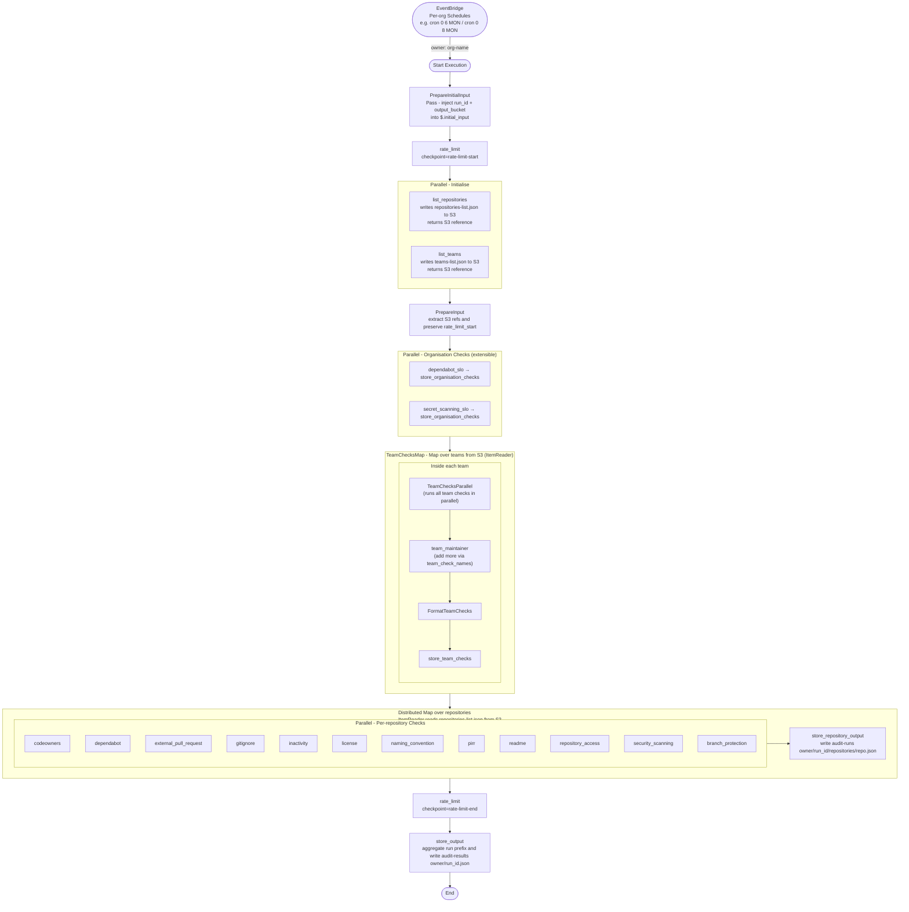

# Step Function Flow - GitHub Policy Audit

## Overview

The Step Function is triggered weekly by per-organisation EventBridge schedules and orchestrates all Lambda functions to audit GitHub organisation policy compliance, then store results in S3 using run-scoped prefixes.

**Trigger:** One EventBridge rule per organisation, each with its own cron schedule (e.g. `cron(0 6 ? * MON *)` for ONS-Innovation, `cron(0 8 ? * MON *)` for ONSdigital). Configured via `organisation_schedules` in tfvars.  
**Input:** `{"owner": "<org-name>", "levels": ["critical", "high", "medium", "low"]}`

## Rate Limit Notes

Due to the size of some GitHub Organisations, the step function may only be able to run once per hour. The `MaxConcurrency` of the repository checks map is configurable to limit simultaneous GitHub API calls and stay within rate limits.

For more information on rate limits and workflow boundary checkpoints, see [rate-limit-considerations.md](rate-limit-considerations.md).

This workflow also includes two explicit checkpoint tasks so overall quota usage is visible at execution boundaries:

- `rate-limit-start` runs immediately after `PrepareInitialInput`.
- `rate-limit-end` runs after repository checks complete and before final aggregation.

The function has been tested against 2 organisations of various sizes:

- Organisation A:
  - ~1,400 repositories
  - ~350 teams
  - ~14 minutes execution time (with `MaxConcurrency = 5`)
  - ~460 GitHub API Rate Limit Used
- Organisation B:
  - ~100 repositories
  - ~20 teams
  - ~1.5 minutes execution time (with `MaxConcurrency = 5`)
  - ~90 GitHub API Rate Limit Used

Scaling beyond 1,500 repositories may require further tuning of `MaxConcurrency` and/or splitting the organisation into multiple runs.
For our current use case at ONS, the current configuration is sufficient to run weekly audits of all repositories and teams in a single execution.

## Flow



## Stage Summary

| Stage | State Type | Lambdas |
| --- | --- | --- |
| Prepare initial input | `Pass` | None (injects `run_id` and `output_bucket` into `$.initial_input`) |
| Rate-limit start | `Task` | `rate_limit` (`checkpoint=rate-limit-start`) |
| Initialise | `Parallel` | `list_repositories` (writes to S3, returns reference), `list_teams` (writes to S3, returns reference) |
| Prepare input | `Pass` | None (reshapes root state; promotes S3 refs and `rate_limit_start`) |
| Organisation checks | `Parallel` (extensible via `organisation_check_names`) | `dependabot_slo`, `secret_scanning_slo` → `store_organisation_checks` (one file per check) |
| Team checks | `Map` → `Parallel` (runs all team checks in parallel per team, extensible via `team_check_names`) | `team_maintainer` (and other team checks as added) |
| Team checks format | `Pass` | None (reformats check results array to dict) |
| Team checks write | `Task` | `store_team_checks` (aggregates checks and writes per team to S3) |
| Repository checks | `Map` (Mode=`DISTRIBUTED`, MaxConcurrency=5) + `Parallel` | `codeowners`, `dependabot`, `external_pull_request`, `gitignore`, `inactivity`, `license`, `naming_convention`, `pirr`, `readme`, `repository_access`, `security_scanning`, `branch_protection` |
| Repo output write | `Task` | `store_repository_output` |
| Rate-limit end | `Task` | `rate_limit` (`checkpoint=rate-limit-end`) |
| Final aggregation | `Task` | `store_output` |

## Storage and Lifecycle

Audit artifacts are organised by entity type and stored with run-scoped prefixes:

**Repository-level artifacts:**

- `audit-runs/<owner>/<run_id>/repositories-list.json` - List of repositories
- `audit-runs/<owner>/<run_id>/repositories/<repository>.json` - Per-repository check results

**Team-level artifacts:**

- `audit-runs/<owner>/<run_id>/teams-list.json` - List of teams
- `audit-runs/<owner>/<run_id>/teams/<team-slug>.json` - Per-team check results

**Organisation-level artifacts:**

- `audit-runs/<owner>/<run_id>/organisation-checks/dependabot_slo.json` - Dependabot SLO check results
- `audit-runs/<owner>/<run_id>/organisation-checks/secret_scanning_slo.json` - Secret scanning SLO check results

**Final run summary:**

- `audit-results/<owner>/<run_id>.json` - Aggregated results across all repositories, teams, and organisation checks

S3 lifecycle rules manage growth:

- `audit-runs/` uses short retention (`audit_run_retention_days`, default 30).
- `audit-results/` uses longer retention (`audit_summary_retention_days`, default 365).

## Rate Limit and State Size Considerations

The repository checks map uses `Mode = DISTRIBUTED` and `MaxConcurrency = 5` (configurable) to limit simultaneous GitHub API calls and stay within rate limits.

The 11 per-repository checks run in parallel within each repository item, but Step Functions state remains small because repository check outputs are persisted to S3 and discarded from parent execution state after each item.

Each per-repository check task also includes a retry policy for transient failures (`Lambda.ServiceException`, `Lambda.AWSLambdaException`, `Lambda.SdkClientException`, `States.TaskFailed`) with `IntervalSeconds=2`, `BackoffRate=2.0`, and `MaxAttempts=3`.

## Data Flow

### 1. EventBridge → PrepareInitialInput

EventBridge injects the initial execution input:

```json
{
    "owner": "ONS-Innovation",
    "levels": ["critical", "high", "medium", "low"]
}
```

`PrepareInitialInput` is a Pass state that injects the execution name as `run_id` and the audit S3 bucket as `output_bucket`. It writes these into `$.initial_input` using `ResultPath`, preserving the original top-level keys:

```json
{
    "owner": "ONS-Innovation",
    "levels": ["critical", "high", "medium", "low"],
    "initial_input": {
        "owner": "ONS-Innovation",
        "levels": ["critical", "high", "medium", "low"],
        "run_id": "<sfn-execution-name>",
        "output_bucket": "<s3-bucket-name>"
    }
}
```

The `Initialise` parallel state then fans out to `list_repositories` and `list_teams`, both reading from `$.initial_input.*`.

### 1b. RateLimitStart checkpoint

Before initialization fan-out, a dedicated `rate_limit` task is invoked with:

```json
{
    "owner": "ONS-Innovation",
    "checkpoint": "rate-limit-start"
}
```

The response is persisted at `$.rate_limit_start` and carried through to final aggregation.

### 2. Initialise → PrepareInput

`list_repositories` receives `owner`, `run_id`, and `output_bucket` from `$.initial_input`. It fetches all non-archived repositories, writes the full list as `repositories-list.json` to S3, and returns a lightweight reference:

```json
{
    "s3_bucket": "<s3-bucket-name>",
    "s3_key": "audit-runs/ONS-Innovation/<run_id>/repositories-list.json",
    "repository_count": 42,
    "environment": "prod"
}
```

The parallel branches return their results as an array under `$.initial_data`:

```json
{
    "owner": "ONS-Innovation",
    "levels": ["critical", "high", "medium", "low"],
    "initial_data": [
        { "s3_bucket": "<s3-bucket-name>", "s3_key": "audit-runs/ONS-Innovation/<run_id>/repositories-list.json", "repository_count": 42 },
        { "s3_bucket": "<s3-bucket-name>", "s3_key": "audit-runs/ONS-Innovation/<run_id>/teams-list.json", "team_count": 8 }
    ]
}
```

> Both the repository list and team list are written to S3 rather than held in Step Function state because large organisations (3 000+ repos or teams) would otherwise exceed the 256 KB state-size limit. The S3 references are passed through state, while actual iteration happens via ItemReader, keeping state minimal.

### 3. PrepareInput → OrganisationChecks

`PrepareInput` is a Pass state that reshapes the execution state, extracting `owner`, `levels`, `run_id`, and `output_bucket` from `$.initial_input`, the S3 references from `initial_data[0]` and `initial_data[1]`, and carrying forward `rate_limit_start`:

```json
{
    "owner": "ONS-Innovation",
    "levels": ["critical", "high", "medium", "low"],
    "run_id": "<sfn-execution-name>",
    "output_bucket": "<s3-bucket-name>",
    "repositories_s3_ref": { "s3_bucket": "<s3-bucket-name>", "s3_key": "audit-runs/ONS-Innovation/<run_id>/repositories-list.json", "repository_count": 42 },
    "teams_s3_ref": { "s3_bucket": "<s3-bucket-name>", "s3_key": "audit-runs/ONS-Innovation/<run_id>/teams-list.json", "team_count": 8 },
    "rate_limit_start": { "checkpoint": "rate-limit-start", "remaining": 4988, "limit": 5000, "reset": 1721668800, "used": 12, "retrieved_at": "..." }
}
```

> Because this state writes to the root object (`ResultPath = "$"`), any field not listed in `PrepareInput.Parameters` is dropped. This is really important to consider when adding new fields to the state, as they will be lost unless explicitly preserved.

Both `repositories_s3_ref` and `teams_s3_ref` are lightweight references to data in S3. The actual team and repository lists are fetched from S3 via `ItemReader` during iteration in the respective maps, keeping state minimal and uniform.

### 4. OrganisationChecks

Three branches run in parallel. Each branch receives a subset of the state and writes results to S3:

| Branch | Receives | Writes to S3 |
| --- | --- | --- |
| `dependabot_slo` → `store_organisation_checks` | `owner`, `levels` | `organisation-checks/dependabot_slo.json` |
| `secret_scanning_slo` → `store_organisation_checks` | `owner` | `organisation-checks/secret_scanning_slo.json` |
| `TeamMaintainerMap` (Map over `teams` from S3 ItemReader) → `store_team_check` | `owner`, `run_id`, `output_bucket`, `team.slug` per iteration | `teams/{team_slug}.json` |

The organisation-level check Lambdas return their results:

```json
{ "check_name": "dependabot_slo", "result": "pass", "message": "..." }
```

The `store_organisation_checks` Lambda writes this to S3 and returns nothing to state (`ResultPath: null`), keeping check results out of the execution state.

Similarly, `store_team_checks` writes individual team check results to S3 and returns nothing to state (`ResultPath: null`).

All other top-level keys (`owner`, `run_id`, `output_bucket`, `repositories_s3_ref`, `teams_s3_ref`) are preserved unchanged. **No check results are held in state** — all are written to and later read from S3.

### 5. RepositoryChecksMap (Distributed Map)

The map uses a native `ItemReader` to fetch `repositories-list.json` directly from S3 and iterate over it, without loading any data into Step Function state. The file is written as a bare JSON array by `list_repositories`, which is what `InputType: JSON` requires. This avoids the 256 KB state-size limit entirely and allows the map to scale to thousands of repositories.

Each item in the array spawns a child execution. The item selector passes only what each child needs:

```json
{
    "owner": "ONS-Innovation",
    "run_id": "<sfn-execution-name>",
    "output_bucket": "<s3-bucket-name>",
    "repository": { "name": "repo-a", "data": { "default_branch": "main", "updated_at": "...", "visibility": "private", "security_and_analysis": {} } }
}
```

Inside each child execution, 11 repository check Lambdas run in parallel. Each check Lambda receives `owner`, `repository_name`, and `data`, and returns:

```json
{ "check_name": "readme", "result": "pass", "message": "README exists" }
```

The `ResultSelector` on each check task strips any additional fields, retaining only `check_name`, `result`, and `message`. The `RepositoryChecksParallel` state collects all 11 results into `$.check_results`.

`FormatRepositoryChecks` then assembles the write payload:

```json
{
    "owner": "ONS-Innovation",
    "run_id": "<sfn-execution-name>",
    "output_bucket": "<s3-bucket-name>",
    "repository_name": "repo-a",
    "checks": [
        { "check_name": "readme",      "result": "pass", "message": "..." },
        { "check_name": "codeowners",  "result": "fail", "message": "..." }
    ]
}
```

#### S3 write - per repository

`store_repository_output` writes this payload to S3 and returns nothing to the parent state (`ResultPath: null`):

```bash
s3://<bucket>/audit-runs/<owner>/<run_id>/repositories/<repository_name>.json
```

The parent map's `ResultPath` is also `null`, so no repository data accumulates in the parent execution state.

> This write is **crucial** for scaling since the step function state size is too small to handle all repository check results in memory. Each child execution writes its results to S3 and discards them from state, allowing the parent execution to continue without exceeding the 256KB state limit.
>
> Similarly, team check results are written to S3 within the team map iteration, keeping team results out of the parent execution state.

### 6. RateLimitEnd checkpoint

After organisation checks and repository map completion, and before final aggregation, `rate_limit` is invoked again:

```json
{
    "owner": "ONS-Innovation",
    "checkpoint": "rate-limit-end"
}
```

The response is stored at `$.rate_limit_end`.

At this point, the execution state contains:

- S3 references for repositories and teams (used by ItemReaders)
- Rate-limit checkpoints (rate_limit_start, rate_limit_end)
- **Zero check results in state** — all written to S3 (repositories, teams, organisation checks)

### 7. store_output (Final Aggregation)

After all repository child executions complete, `store_output` is invoked with owner, run_id, output bucket, and rate-limit data:

```json
{
    "owner": "ONS-Innovation",
    "run_id": "<sfn-execution-name>",
    "output_bucket": "<s3-bucket-name>",
    "rate_limit_start": { "checkpoint": "rate-limit-start", "remaining": 4988, "limit": 5000, "reset": 1721668800, "used": 12, "retrieved_at": "..." },
    "rate_limit_end": { "checkpoint": "rate-limit-end", "remaining": 4321, "limit": 5000, "reset": 1721668800, "used": 679, "retrieved_at": "..." }
}
```

The Lambda constructs paths using `owner` and `run_id` and loads all data from S3 (or from local files in local mode):

- Team check results from `audit-runs/<owner>/<run_id>/teams/`
- Organisation check results from `audit-runs/<owner>/<run_id>/organisation-checks/`
- Repository list and results from `audit-runs/<owner>/<run_id>/repositories/`

Then aggregates and writes to final summary.

#### S3 write - final summary

```bash
s3://<bucket>/audit-results/<owner>/<run_id>.json
```

The summary file structure:

```json
{
    "owner": "ONS-Innovation",
    "repositories": {
        "repo-a": {
            "checks": {
                "readme": {
                    "result": "pass",
                    "message": "..."
                }
            },
            "is_compliant": true,
            "rating": "non-compliant"
        }
    },
    "organisation_checks": {
        "dependabot_slo": { "result": "pass", "message": "..." }
    },
    "teams": {
        "team-a": {
            "checks": {
                "team_maintainer": {
                    "result": "pass",
                    "message": "..."
                }
            },
            "is_compliant": true
        }
    },
    "summary": {
        "total_repositories": 1,
        "compliant_repositories": 1,
        "total_teams": 1,
        "compliant_teams": 1,
        "repository_checks": { "readme": { "total": 1, "compliant": 1 } },
        "organisation_checks": { "dependabot_slo": { "compliant": true } },
        "team_checks": { "team_maintainer": { "total": 1, "compliant": 1 } }
    },
    "rate-limit-start": { "checkpoint": "rate-limit-start", "remaining": 4988, "limit": 5000, "reset": 1721668800, "used": 12, "retrieved_at": "..." },
    "rate-limit-end": { "checkpoint": "rate-limit-end", "remaining": 4321, "limit": 5000, "reset": 1721668800, "used": 679, "retrieved_at": "..." },
    "timestamp": "2026-07-16T08:00:00+00:00"
}
```

Because `store_output` is the terminal task, these same `rate-limit-start` and `rate-limit-end` fields are also present in the final Step Functions execution output.
